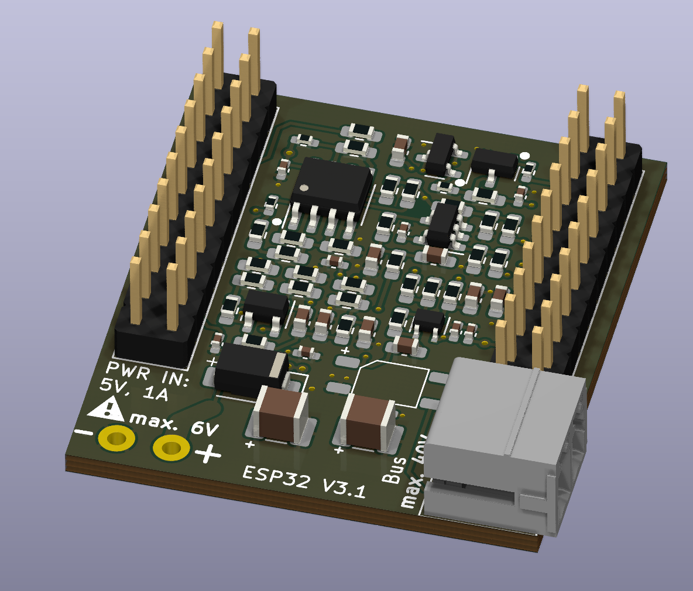
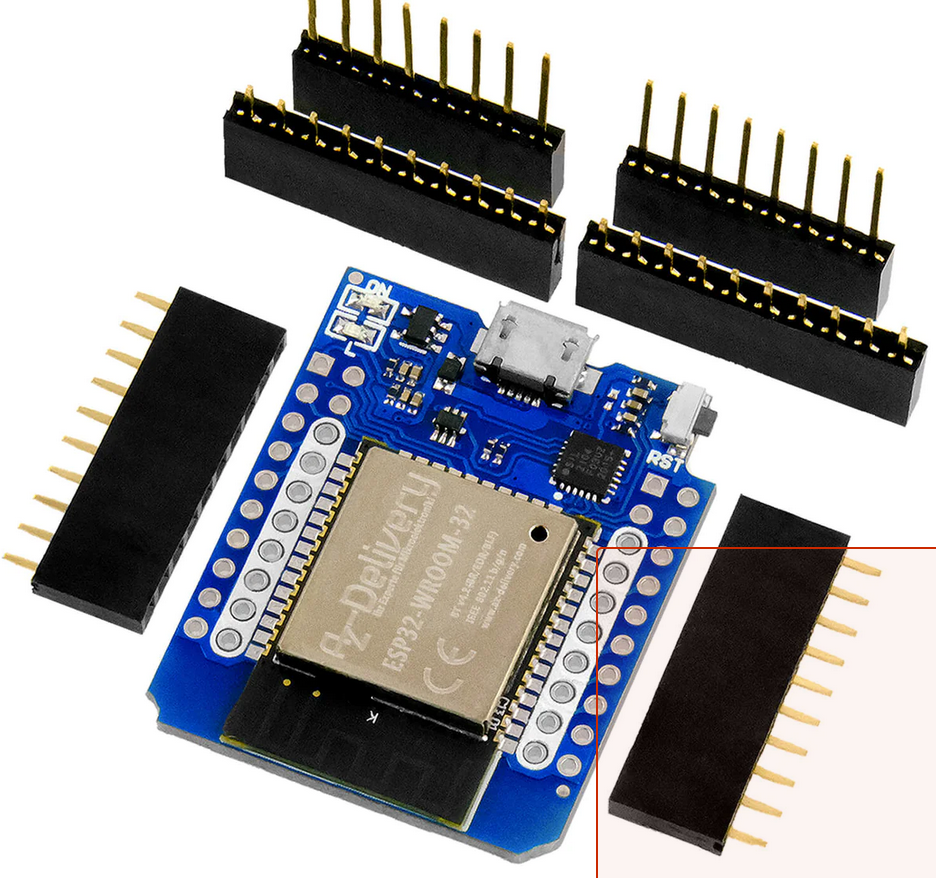
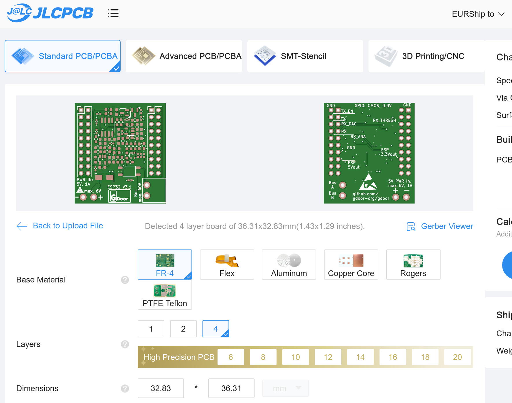
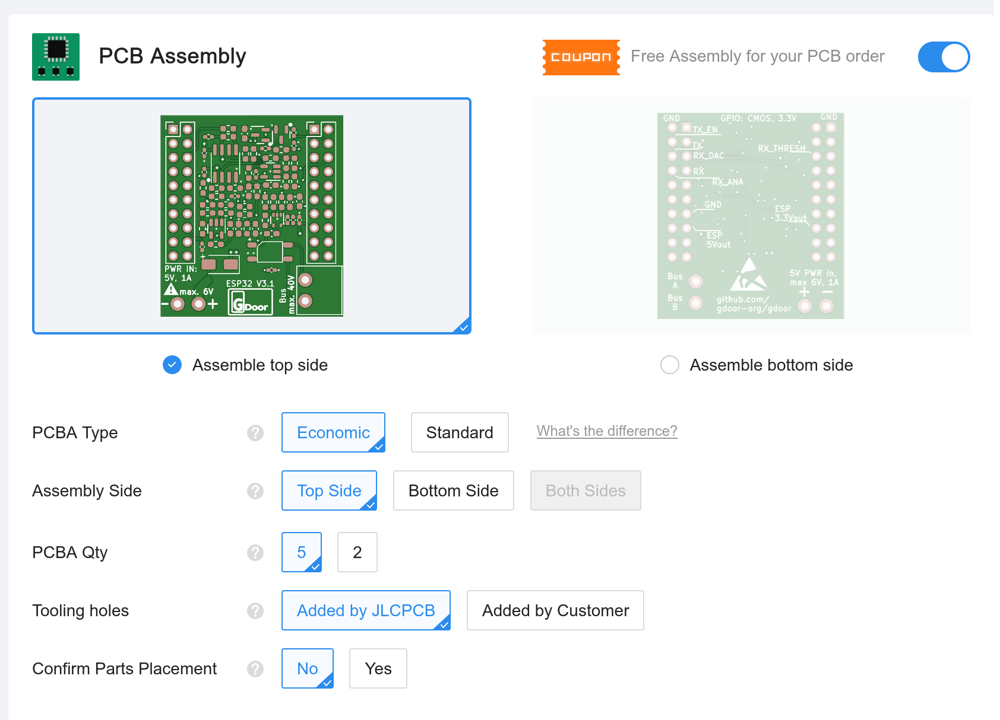
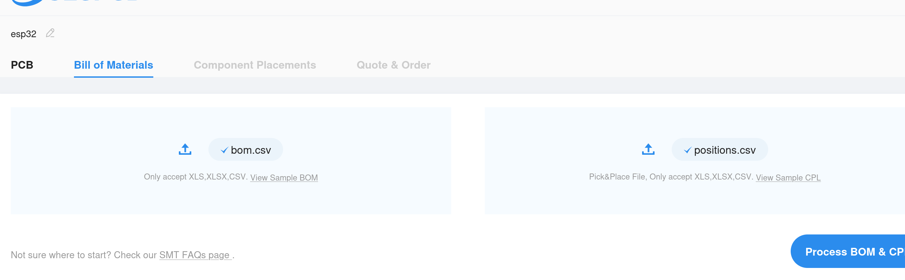
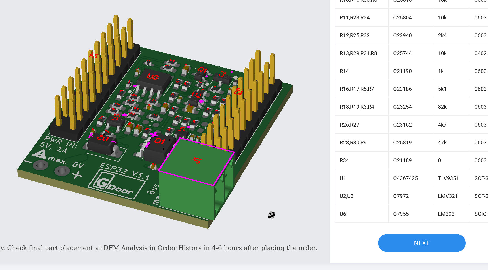

# Buying the GDOOR Bus Adapter

Production costs for the GDOOR bus adapter, incl. shipping and taxes, are ~ 40€ to 50€ for 5 adapters (Minimum Order Quantity).
Additionally you need an ESP32 (~ 10€) (e.g. [Buy here](https://www.az-delivery.de/en/products/esp32-d1-mini)).

The GDOOR project is a non profit project by home automation enthusiasts.
We do not directly sell the hardware adapter,
but we tried to make it very easy to procure one yourself, fully assembled.

You have three possibilities:
1. Ask in our [Issue Tracker](https://github.com/gdoor-org/gdoor/issues) if someone has
a not needed bus adapter.
2. Procure it fully assembled, directly from [JLCPCB](https://jlcpcb.com).
You just need to upload the latest hardware production data from the [Github Release Page](https://github.com/gdoor-org/gdoor/releases/).
3. Build it yourself, it is fully open source!

# Procure it from JLCPCB
You can order fully assembled hardware adapters from [JLCPCB](https://jlcpcb.com).
You need to:
- Upload the production data zip file ([Github Release Page](https://github.com/gdoor-org/gdoor/releases/)).
- Select needed quantity (min. 5)
- Leave the rest on default
- Select Assembly Service
- Upload the BoM and CPL files
- Finish checkout

