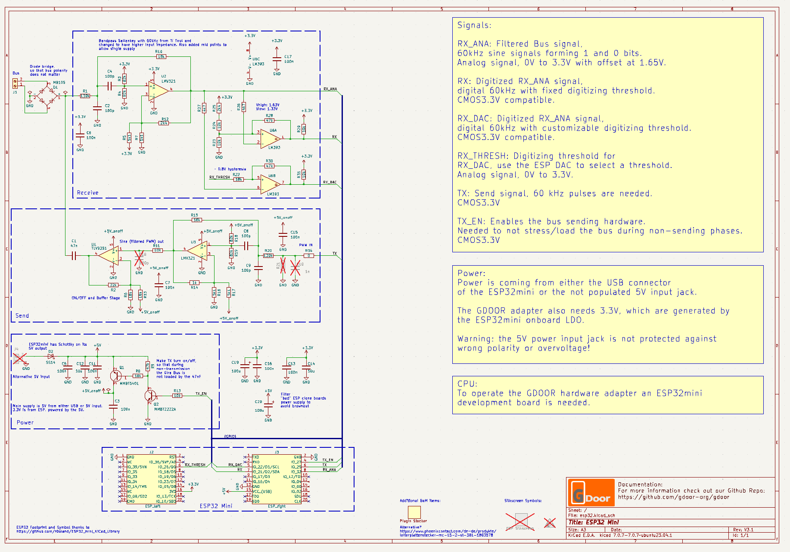
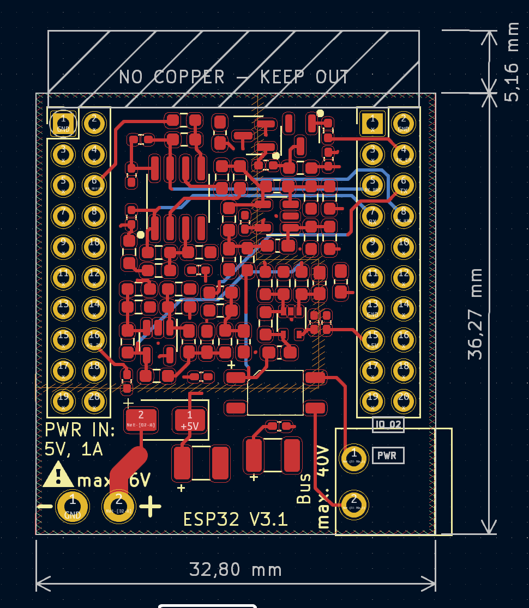
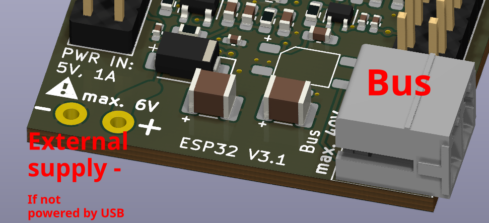

# Getting Started
{: #started}
You will need the following hardware items to get started:

- ESP32Mini (e.g. [Buy here](https://www.az-delivery.de/en/products/esp32-d1-mini))
- GDOOR hardware adapter PCB. See more details under [Buy](./buy.html).

# Initial Setup
{: #setup }
With the fully build GDOOR hardware you can get started to connect it to the bus:

1. Connect the adapter via USB to your PC.
2. Flash the GDOOR adapter firmware.
You can use our web-programmer tool: [Web Installer](./web-installer.html)
3. After the firmware is flashed, the adapter will create a WiFi called `GDOOR`.
4. Connect to it with the password `12345678`
5. Once connected, you can surf to [192.168.4.1](http://192.168.4.1)
and setup the connection to your home WiFi and all needed MQTT settings like:
- MQTT Broker Network Address
- MQTT Username, Password (both optional)
- MQTT topic where door bus data is send to
- MQTT topic, to which the adapter subscribes and sends received data onto the bus
6. After successfully setting up the adapter, you can connect it to the Gira TKS Bus.
The bus polarity does not matter as the bus adapter automatically connects the right way.
7. You can disconnect your computer via USB, but the adapter needs to be powered by either the USB bus,
or the dedicated and labeled pins with a good 5V, min. 1A power supply.

# Connection Warning
{: #warning }

Be careful if you connect an external 5V supply via the dedicated pins,
ensure correct polarity and voltage levels!
Do not connect the bus to this input!

# Usage with home automation
{: #usage }
You can use [MQTT Explorer](https://mqtt-explorer.com/) to test the connection,
or visit the [documentation](https://github.com/gdoor-org/gdoor/blob/main/doc/integrations/home-assistant.md) how to set up your home automation system.

# Detailed Documentation
{: #more }
Detailed and up-to-date information, including Gira TKS bus protocol,
hardware adapter details, schematics etc. are in the [Github Repo](https://github.com/gdoor-org/gdoor/)